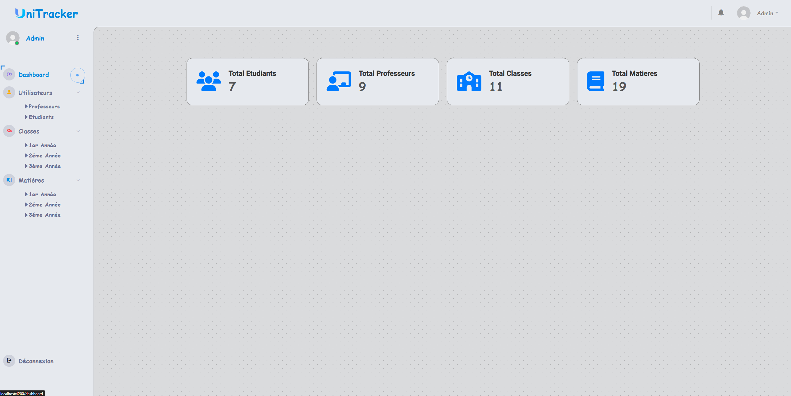
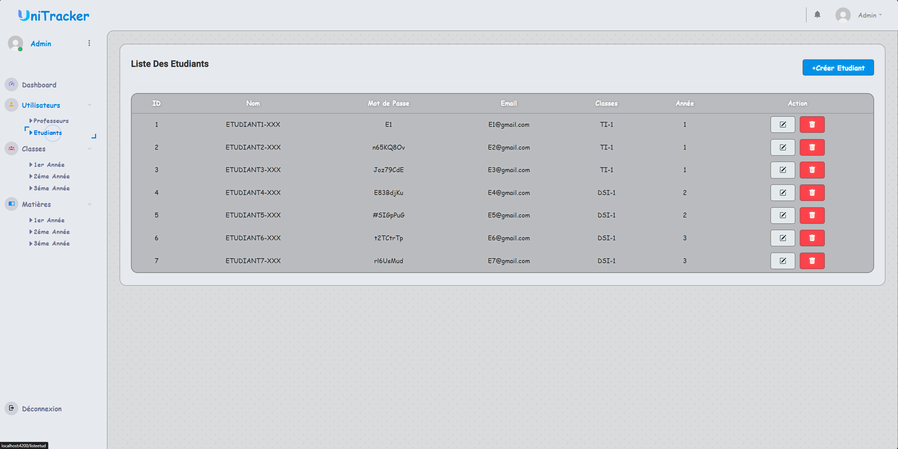
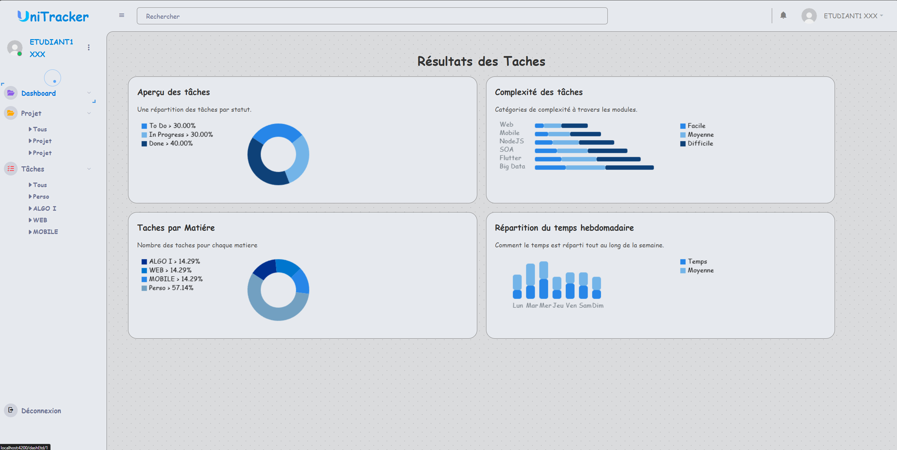
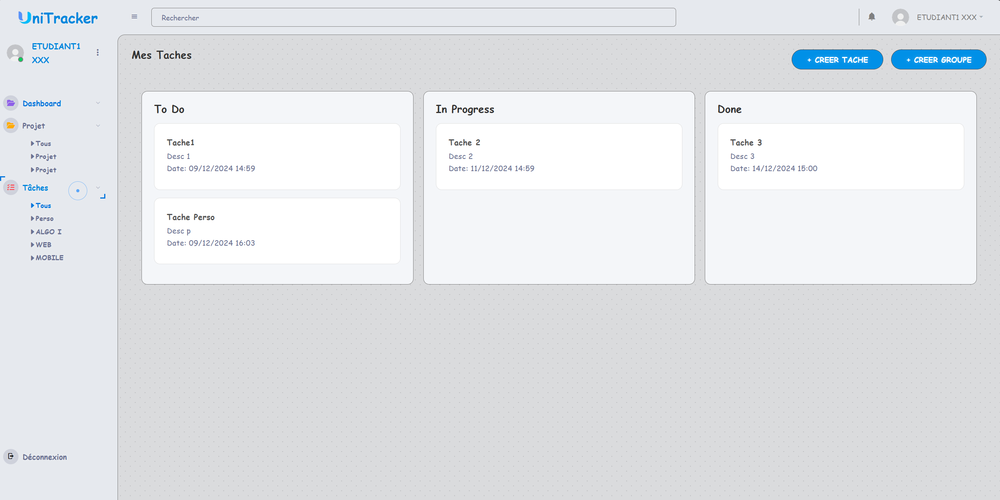
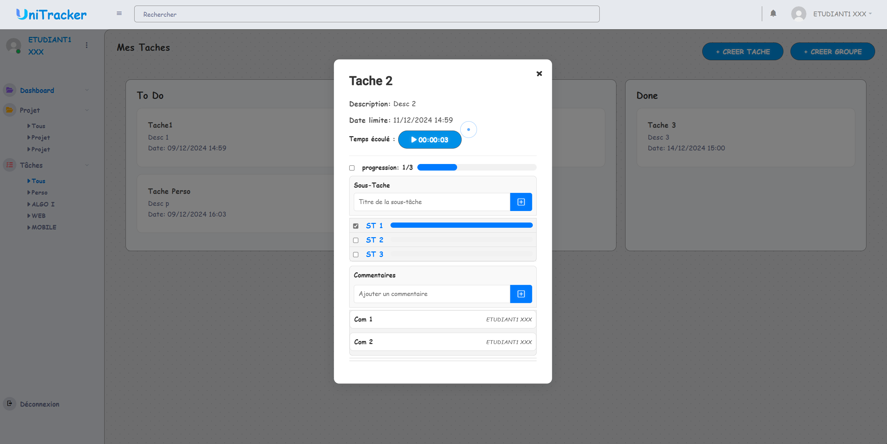
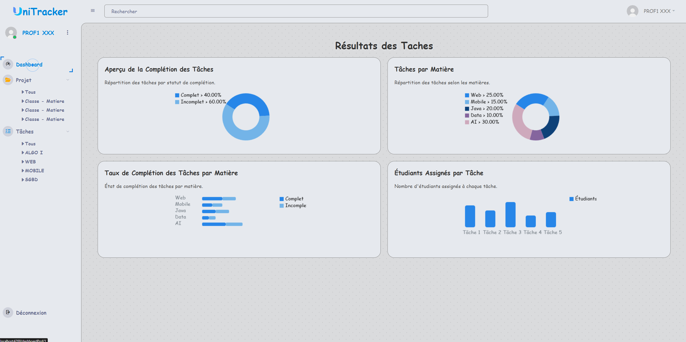
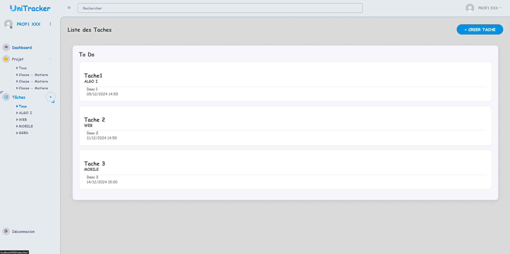
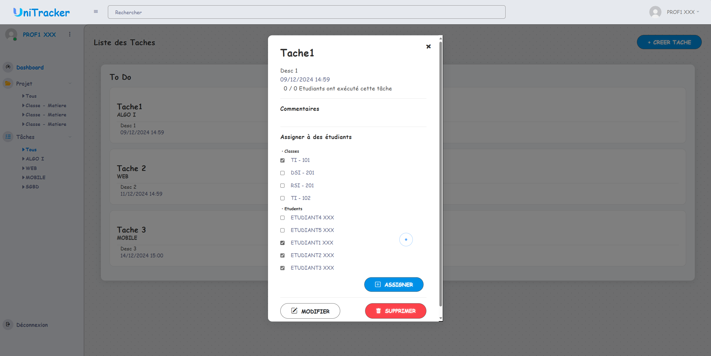
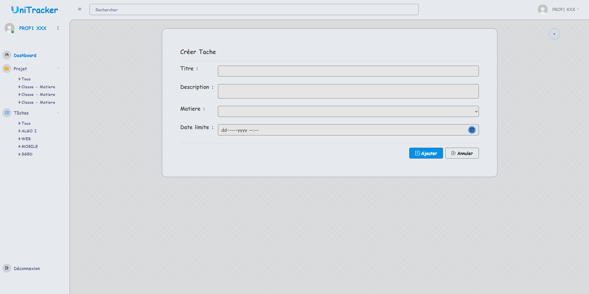
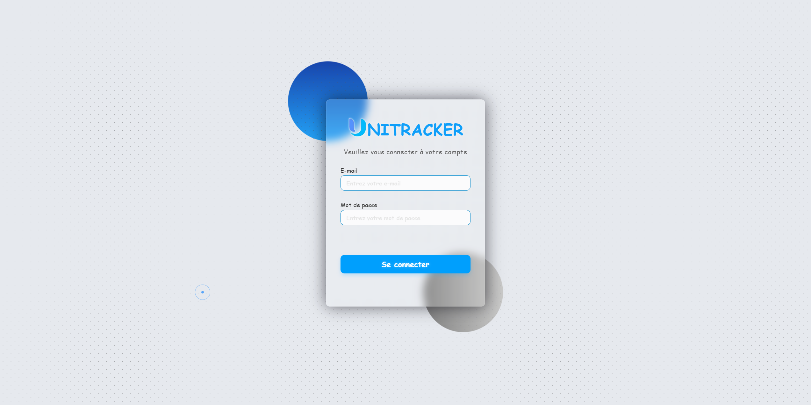

# **Unitracker: A Next-Gen Task Management Solution**

**Welcome to Unitracker**, the ultimate task management app designed for students, professors, and administrators! Whether you're managing your academic assignments, projects, or professional goals, Unitracker keeps you organized and on track. 

From intuitive task views to real-time updates, we've created a seamless experience for all user roles. Dive into the world of easy task management and get things done efficiently, with the power of **Unitracker**.


---

## **🎯 Features & Highlights**

### 🚀 **Advanced Task Management**
- **Create Tasks**: Add tasks with details such as name, description, due date, and subject.
- **Organize Tasks**: Assign categories to tasks (e.g., Personal, Work, Study) for easy filtering.
- **Difficulty System**: Mark tasks as High, Medium, or Low difficulty for better management.
- **Task Progress**: Mark tasks as **Completed**, **In Progress**, or **Pending** to track their progress.

### 🛠 **User Authentication**
- **JWT Authentication** for secure login.
- **Multiple User Profiles**: Admin, Professor, and Student roles for specialized task management.

### 📅 **Real-time Task Updates**
- Stay informed with **push notifications** for task deadlines.
- Track all tasks in a **calendar view** to visually manage deadlines.

### 🌐 **Role-based Access**
- **Admin Dashboard**: Manage users, tasks, and data across the system.
- **Professor Dashboard**: Assign tasks and track student progress.
- **Student Dashboard**: Keep track of assigned tasks and academic performance.

---

## **🧑‍💻 Tech Stack**

Unitracker leverages modern technologies to ensure scalability, performance, and an excellent user experience:

- **Frontend**: Angular, TypeScript, HTML5, CSS3, Bootstrap
- **Backend**: Spring Boot (Java), REST APIs
- **Database**: MySQL
- **Authentication**: JSON Web Tokens (JWT)

---

## **💡 How to Get Started**

Set up **Unitracker** locally with just a few simple steps!

### Step 1: Clone the Repository

```bash
git clone https://github.com/CodeWizard-404/unitracker.git
cd unitracker
```

### Step 2: Install Frontend Dependencies

```bash
cd frontend
npm install
```

### Step 3: Install Backend Dependencies

```bash
cd backend
mvn install
```

### Step 4: Run the Application

#### Frontend:
```bash
ng serve --open
```

#### Backend:
```bash
mvn spring-boot:run
```

You're all set! Enjoy the power of **Unitracker** right at your fingertips.

---

## **🔍 Key Screenshots & Demos**

Here’s a sneak peek into the app with user interface screenshots for different roles:

### **Admin Dashboard**


The **Admin Dashboard** gives you an overview of the entire system, including user management and task allocation. Admins can easily mangae the database.

### **Student Dashboard**

Students can track all their tasks in one place. A clean, user-friendly interface provides easy access to ongoing projects and tasks.

### **Student Task **


View tasks with real-time updates on deadlines, status, and progress. The student view is optimized for ease of use and accessibility.

### **Professor Dashboard**

Professors can assign and monitor tasks with an intuitive interface, track students' progress, and provide timely feedback.

### **Professor Task**



The professor’s task view offers in-depth control over task assignments, and detailed tracking of students' progress.

### **Login**



---

## **💡 Key Features in Detail**

### 1. **Task Creation & Management**
Professors, and students can easily create, manage, and organize tasks. The task management system includes essential features like:
- Task name, description, and Subject
- Due dates with reminders
- Task status (Pending, In Progress, Completed)

### 2. **User Authentication**
**JWT Authentication** ensures that users can securely log in and manage their tasks. Different access levels are assigned to admins, professors, and students, each with specific features tailored to their roles.

### 3. **Push Notifications**
Get instant notifications for task deadlines, new task assignments, and updates. Stay on top of your tasks with minimal effort.

### 4. **Collaboration**
Professors can collaborate with students by assigning tasks, and tracking progress in real-time.

**To Be Added :**
### 5. **Calendar Integration**
See all your tasks and deadlines in one easy-to-read calendar view. Visualize your schedule and never miss a deadline again!

---

## **📈 Contribution Guidelines**

We welcome contributions to **Unitracker**! Here’s how you can get involved:
1. Fork the repo on GitHub.
2. Create a new branch: `git checkout -b feature-xyz`.
3. Make your changes and commit them: `git commit -am 'Add feature XYZ'`.
4. Push your branch: `git push origin feature-xyz`.
5. Create a pull request for review.

We follow the **GitFlow** workflow for new features and bug fixes.

---

## **📜 License**

This project is licensed under the MIT License – see the [LICENSE](LICENSE) file for details.

---

## **🎨 Design & Aesthetics**

Unitracker boasts a clean and modern interface designed to boost productivity. We've used **smooth animations** to transition between views, making the task management experience enjoyable and seamless. Check out these lively animations below!

---

### **🚀 Ready to Get Started?**

Clone the repository, follow the setup instructions, and start organizing your tasks today with **Unitracker**!
